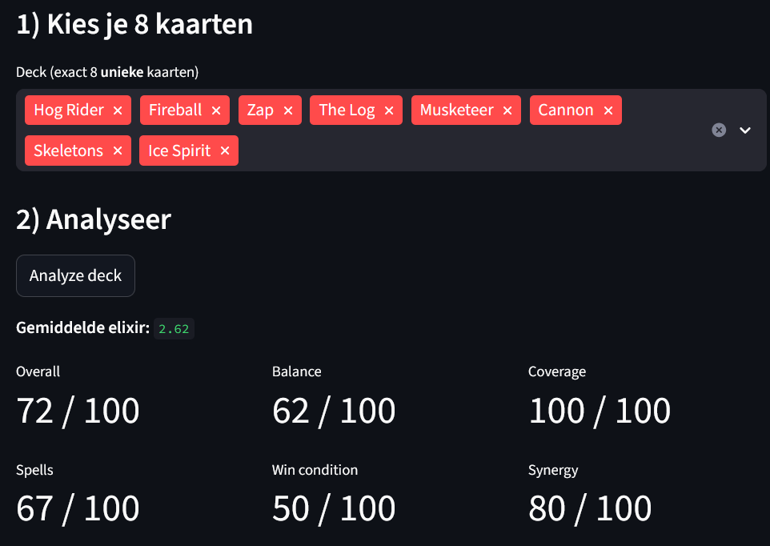
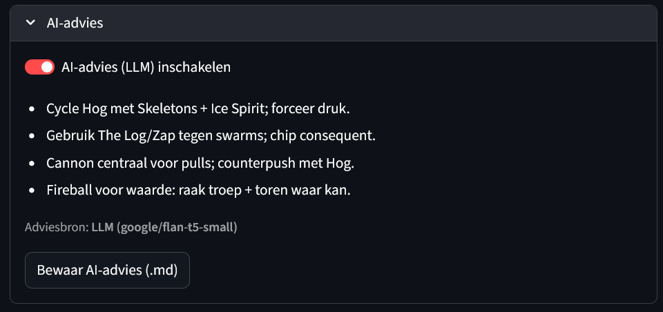

# Clash Royale Deck Analyzer
Evaluatie van 8-kaart decks met **heuristische metrics** + **lokaal LLM-advies**.

## Snel starten
```bash
python -m venv .venv && .venv\Scripts\Activate.ps1  # Windows
pip install -r requirements.txt
streamlit run app.py
```

## Wat je ziet
- Metrics: average elixir, balance, coverage, spells, wincon, synergy → overall.
- AI-advies: lokaal model (FLAN-T5 small) genereert korte tips; bij fout: heuristiek-fallback.

## Screenshots





## Benchmarks
**Volledige tabel (CSV):** [data/benchmarks.csv](data/benchmarks.csv).

**Kort oordeel:**
- LavaLoon — hoogste overall (~0.73): duidelijke wincon + lucht-support.
- Hog 2.6 — sterk (~0.72): perfecte coverage en hoge synergy (lage elixir).
- Giant Beatdown — degelijk (~0.63): lagere balance door zwaardere kaarten.
- X-Bow Cycle — laagst (~0.58): balans neigt defensief.
